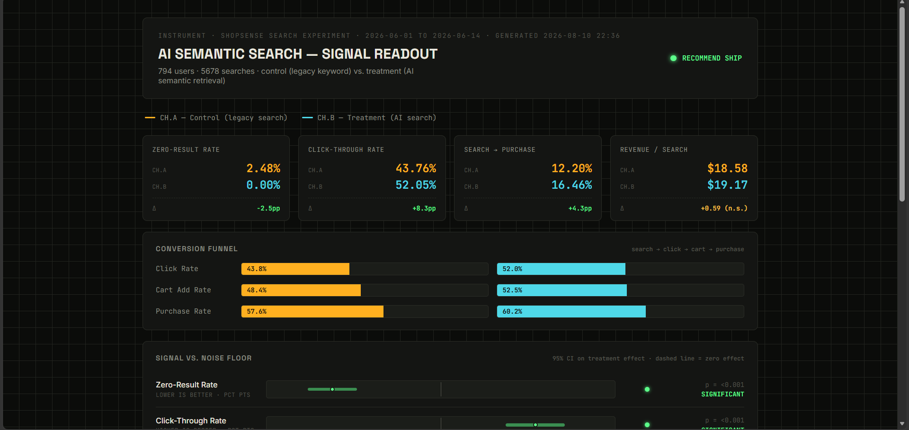
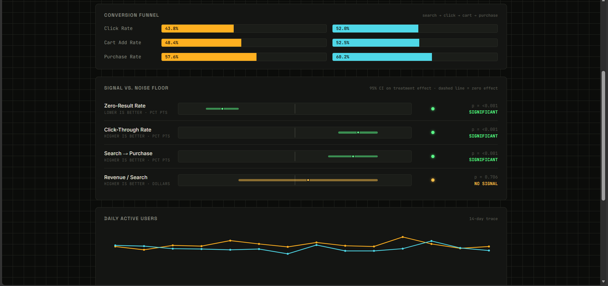
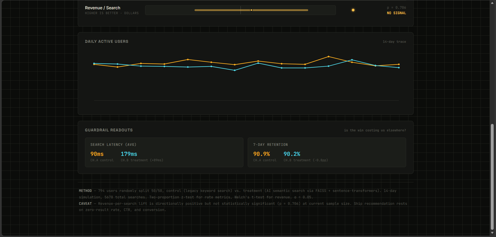

# Smart Search Analytics — AI Product Experimentation Platform

A product analytics and experimentation platform built around one specific question: does semantic search actually make a meaningful difference to the shopping experience, and does the evidence support shipping it?

> **A note on naming:** this repo (`Smart-Search-Analytics`) contains a case study built around a fictional e-commerce company, **ShopSense** — invented to give the analysis a concrete setting, the way a business case study might use a placeholder company name. The repo title reflects what the project does; ShopSense is just the made-up storefront the story revolves around.

---

## 🎯 Product Decision

### Recommendation: ship AI search

A randomized A/B test comparing legacy keyword search against AI-powered semantic search found statistically significant improvements across search success, engagement, and conversion.

| Metric | Legacy Search | AI Search | Outcome |
|---|---:|---:|---|
| Zero-result rate | 2.48% | **0.00%** | Significant (p < 0.001) |
| Click-through rate | 43.76% | **52.05%** | Significant (p < 0.001) |
| Search → Purchase | 12.20% | **16.46%** | Significant (p < 0.001) |
| Revenue / Search | $18.58 | $19.17 | Not significant (p = 0.706) |

AI search clearly improves search quality and what happens downstream of it. What it doesn't yet prove, at this sample size, is a meaningful revenue lift — and it comes with a real latency cost (90ms → 179ms). The case for shipping doesn't lean on that unproven revenue number; it stands on the three metrics that came back statistically solid.

The full reasoning, caveats, and rollout plan live in [`case_study/case_study.md`](./case_study/case_study.md).

---

## 📊 Dashboard

**794 users · 5,678 searches · 14-day experiment**
**Control:** legacy keyword search · **Treatment:** AI semantic search



The dashboard itself is generated live — open `dashboard/index.html` in any browser, or regenerate it anytime with `python src/analysis/generate_dashboard.py`.

---

## 🔎 The Problem

ShopSense's existing search only works through exact keyword matching, and roughly 1 in every 40 searches comes back empty — not because the product isn't in stock, but because the search engine can't handle a typo, a synonym, or someone phrasing a query in plain language. Every one of those empty searches is a shopper who might just quietly leave.

The question this project set out to answer: is AI-powered semantic search worth enough, in measurable terms, to replace the existing search experience? Rather than judging the AI system purely on how good its retrieval looks, this project evaluates it the way a product team actually would — through a controlled experiment and real product metrics.

---

## 🧪 Experiment Design

**Hypothesis:** if search results are more relevant, engagement and downstream conversion should improve as a result.

- **Control:** legacy keyword search
- **Treatment:** AI semantic search (embeddings + FAISS retrieval)
- **Primary metrics:** zero-result rate, click-through rate, search → purchase conversion, revenue per search
- **Guardrails tracked:** search latency, 7-day retention
- **Method:** users randomly split 50/50, two-proportion z-tests plus Welch's t-test, with 95% confidence intervals throughout

---

## 🔄 How Data Moves Through This Project

```
                    USER SEARCH
                        │
              ┌─────────┴─────────┐
              ▼                   ▼
       Legacy Search          AI Search
        (Control)            (Treatment)
              │                   │
              └─────────┬─────────┘
                        ▼
                  Event Dataset
                        │
                        ▼
                  SQL Analysis
                        │
                        ▼
             A/B Significance Testing
                        │
                        ▼
                Live Dashboard
                        │
                        ▼
                Product Decision
```

### The AI Search Retrieval Path

```
User Query → Sentence Transformer → Query Embedding
    → FAISS Vector Search → Ranked Product Candidates
    → Search Results → User Interaction
```

This is really just the retrieval half of a RAG setup — embeddings and vector search, no generative component — which keeps things fast, fully local, and easy to reason about when something goes wrong.

---

## 📈 Results

### Conversion Funnel
| Step | Legacy | AI Search |
|---|---:|---:|
| Click rate | 43.8% | **52.0%** |
| Cart-add rate | 48.4% | **52.5%** |
| Purchase rate | 57.6% | **60.2%** |

### Statistical Significance
| Metric | Result |
|---|---|
| Zero-result rate | ✅ Significant |
| Click-through rate | ✅ Significant |
| Search → Purchase | ✅ Significant |
| Revenue per search | ❌ No signal (p = 0.706) — high variance, not resolvable at this sample size |



---

## ⚖️ Tradeoffs & Guardrails

A decision worth trusting has to look past the headline number.

| Guardrail | Legacy | AI Search | Read |
|---|---:|---:|---|
| Avg. search latency | 90ms | 179ms | +89ms — a genuine cost worth watching, not a red flag |
| 7-day retention | 90.9% | 90.2% | −0.8pp — not a meaningful difference |



The honest version of the story: AI search improved relevance and conversion, cost some latency, and left revenue impact unresolved. That's a tradeoff, not a clean sweep — and that's the actual finding worth reporting.

---

## 💡 Recommendation & Next Steps

**Ship AI search to all traffic.** It removes the zero-result problem, lifts engagement, and lifts conversion, all backed by strong statistical evidence (p < 0.001).

**Worth investigating before scaling further:**
- Revenue impact at a larger sample — statistical power should climb fast once this reaches full traffic
- Latency, particularly on mobile or slower connections
- Retention over a longer window than 7 days
- How results vary across query types and user segments

---

## 🛠️ Tech Stack

**Analytics:** Python (pandas, numpy), SQL, SQLite
**AI / Retrieval:** sentence-transformers for local embeddings (no API key needed), FAISS for vector similarity search
**Statistics:** scipy — two-proportion z-tests, Welch's t-test, confidence intervals
**Dashboard:** plain HTML/CSS/JS, rebuilt live from SQL and statistical output each time it runs

---

## 📁 Repository Structure

```
Smart-Search-Analytics/
├── schema/            → product definition, event schema, metrics (Day 1)
├── src/data_generation/  → product catalog + synthetic event generators (Day 2)
├── src/embeddings/    → embedding + FAISS retrieval pipeline
├── src/sql/           → SQLite loader + core analytics queries (Day 3)
├── src/analysis/      → SQL analytics runner + dashboard generator
├── experiment/        → A/B significance testing (Day 6)
├── dashboard/         → live, data-driven HTML dashboard (Day 5)
├── case_study/        → final decision memo (Day 7)
├── assets/            → dashboard screenshots used in this README
├── PROGRESS.md         → full build log, including every bug found and fixed
├── requirements.txt
└── README.md
```

---

## Running This Yourself

```bash
git clone https://github.com/yashpulapalli-eng/Smart-Search-Analytics.git
cd Smart-Search-Analytics
python -m venv venv
source venv/Scripts/activate   # Git Bash on Windows
pip install -r requirements.txt

python src/data_generation/generate_products.py
python src/embeddings/build_embeddings.py
python src/data_generation/generate_events.py
python src/sql/load_to_sqlite.py
python src/analysis/run_analytics.py
python experiment/ab_significance_test.py
python src/analysis/generate_dashboard.py
```

Then just open `dashboard/index.html` in a browser — nothing else needs to be running.

---

## 🎓 What This Project Demonstrates

**Product thinking:** framing a problem around a measurable metric, forming a testable hypothesis, choosing the right metrics, designing the experiment, weighing tradeoffs, and reaching a defensible recommendation
**Analytics:** SQL-based funnel, retention, and cohort analysis, formal significance testing, tracking guardrails alongside the headline metric
**AI/ML:** embeddings, semantic retrieval, vector search with FAISS, evaluating retrieval quality honestly (including where it falls short)
**Engineering:** building a synthetic data pipeline, designing an event schema, keeping the whole thing reproducible end-to-end, generating a live dashboard from real output

---

## Why I Built This

The goal here was to bring together three skills that rarely show up in the same place: a genuinely working AI retrieval pipeline rather than a mocked one, statistical analysis rigorous enough to survive a real experimentation review, and a product recommendation that someone could actually act on. Plenty of tutorials cover each of these separately — what I wanted was to build all three into a single project, using one dataset throughout.

`PROGRESS.md` has the unfiltered build log, including real bugs that came up along the way (a data-integrity issue with duplicate IDs, a couple of path-resolution mistakes, an encoding bug) — working through those is as much a part of the story as the final numbers.